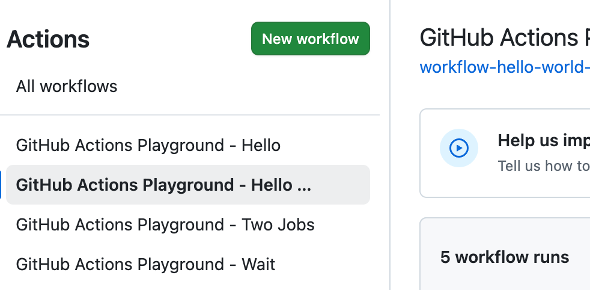
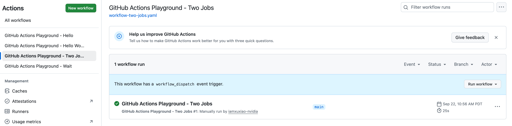
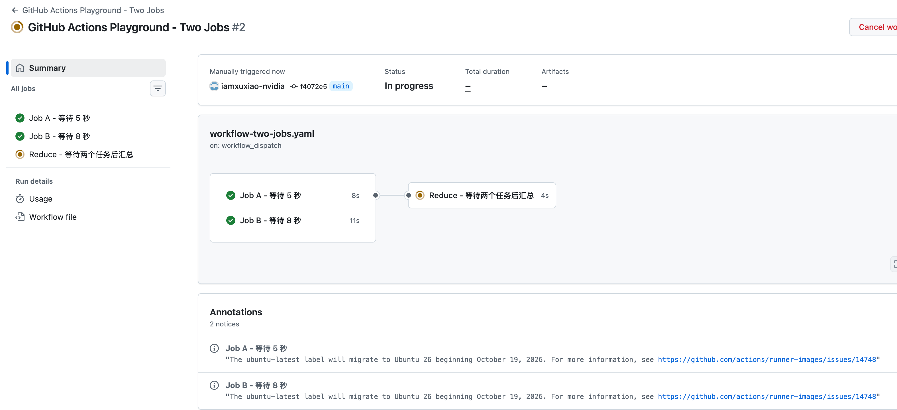
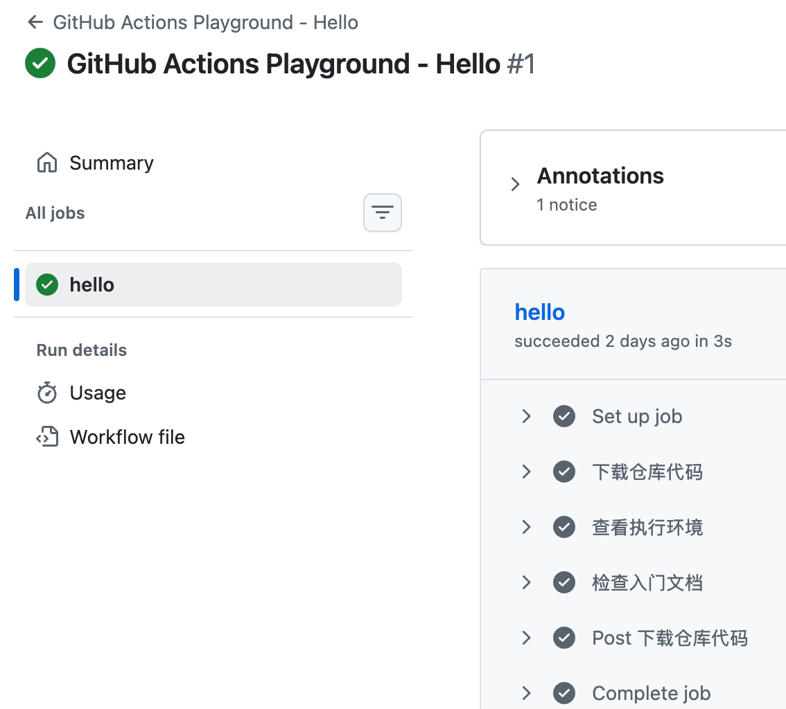
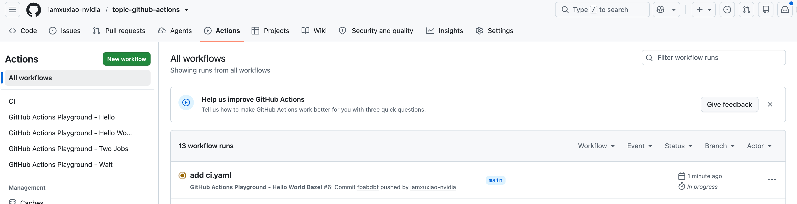
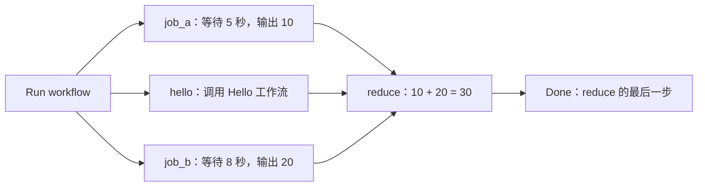
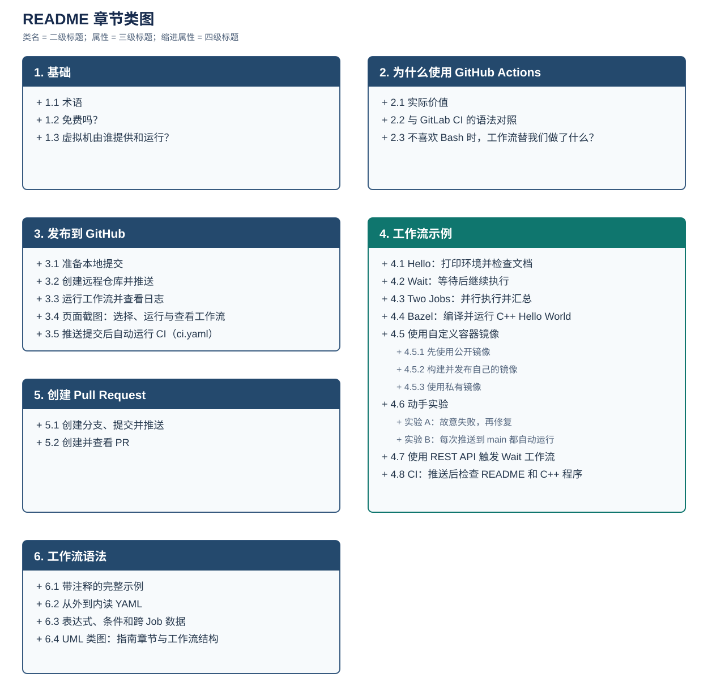
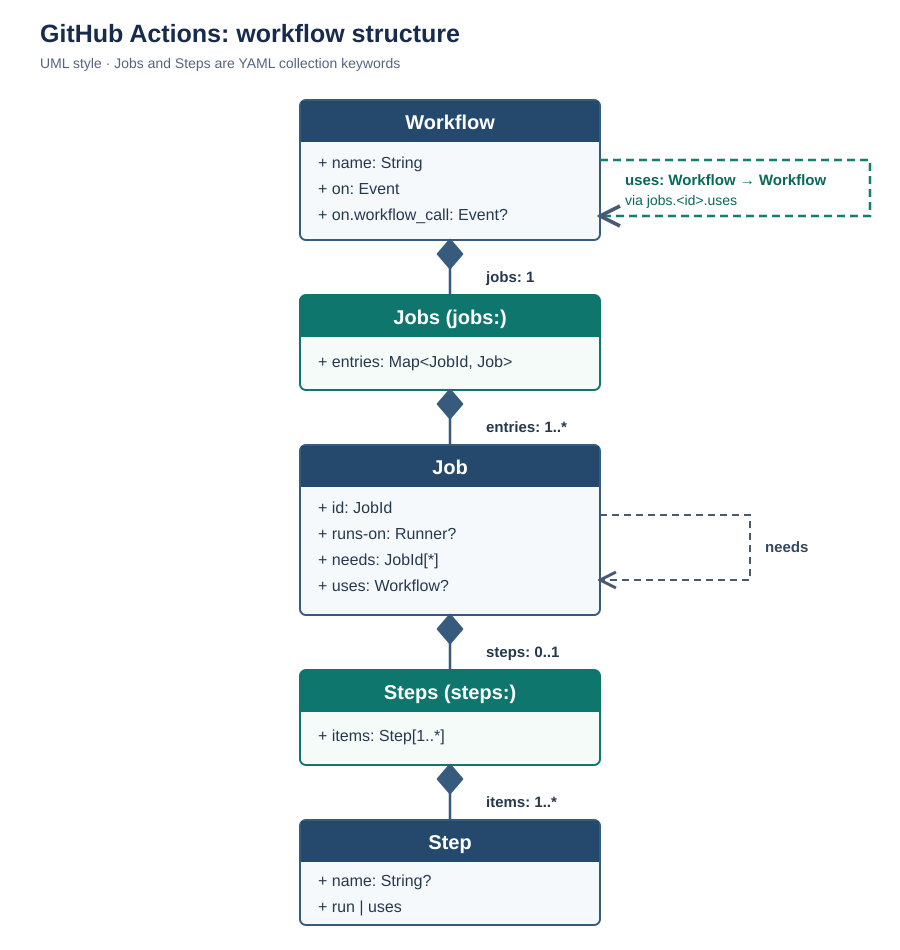

# GitHub Actions 练习仓库

GitHub Actions 让你把自动化流程写进仓库：发生某个事件后，系统安排执行机器，按配置下载代码、运行测试或编译，并展示日志和结果。本指南从基础概念、使用价值、发布到 GitHub，再到可复制的工作流示例逐步介绍。

- [1. 基础](#1-基础)：术语、费用和 Runner。
- [2. 为什么使用 GitHub Actions](#2-为什么使用-github-actions)：价值、GitLab CI 语法对照和 Bash 的取舍。
- [3. 发布到 GitHub](#3-发布到-github)：提交代码、推送仓库、首次运行和推送后自动运行 CI。
- [4. 工作流示例](#4-工作流示例)：Hello、Wait、Two Jobs、Bazel、CI、自定义镜像、动手实验和 REST API 触发。
- [5. 工作流语法](#5-工作流语法)：带注释的 CI 示例、常用字段、表达式、章节与工作流结构类图。

## 1. 基础

### 1.1 术语

| 术语（英文） | 中文理解 | 本仓库或常见示例 |
|---|---|---|
| Workflow | 一整套自动化流程，由 YAML 文件定义 | [Hello 工作流](.github/workflows/workflow-playground-hello.yaml) |
| Event | 触发流程的事件 | `workflow_dispatch`：手动触发；`push`：推送代码 |
| Job | 流程中的一个任务 | `hello` |
| Step | 任务内的一步操作 | 下载代码、查看环境、检查文档 |
| Runner | 实际执行任务的机器或运行环境 | 本例使用 GitHub 提供的 Ubuntu 虚拟机 |
| Action | 可重复使用的操作组件 | 常用 Action 见下方 |

常用 Action：

- `actions/checkout@v6`：下载代码。
- `actions/setup-node@v7`：配置 Node.js。
- `actions/cache@v6`：缓存依赖。
- `actions/upload-artifact@v7`：保存构建产物。

`uses:` 调用现成的 Action；`run:` 执行你写的命令。工作流可以有多个 Job；没有依赖关系的 Job 可并行运行，同一 Job 内本例的 Steps 按顺序执行。参见 [GitHub Actions 核心概念](https://docs.github.com/en/actions/get-started/understand-github-actions)。

### 1.2 免费吗？

**将本项目的练习放在公开仓库，使用标准 `ubuntu-latest` Runner，执行本身免费。**

| 场景 | 费用规则 |
|---|---|
| 公开仓库 + 标准 GitHub 托管 Runner | 执行免费 |
| 私有仓库 + GitHub Free | 每月含 2,000 分钟，仓库所有者账户下的私有仓库共享额度 |
| 私有仓库 + GitHub Pro | 每月含 3,000 分钟 |
| Larger runners（更大规格的执行机器） | 收费，公开仓库也一样 |
| 自托管 Runner | GitHub Actions 使用免费，机器和维护成本由你或公司承担 |

以标准 Linux Runner 为例，一个 Job 运行 5 分钟会消耗 5 分钟额度；多个 Job 的执行用量要累计，失败和重新运行也会计入。超额使用可能收费；未绑定有效支付方式时，额度耗尽会停止运行。

运行分钟数与存储额度分别计算：GitHub Free 包含 500 MB 的制品存储额度，与 GitHub Packages 共享；不能把“公开仓库运行免费”理解成所有存储无限免费。本仓库的练习包含日志、文件检查和 C++ 编译，没有上传构建制品。

参见 [GitHub Actions 官方计费说明](https://docs.github.com/en/billing/concepts/product-billing/github-actions)。

### 1.3 虚拟机由谁提供和运行？

**本例由 GitHub 提供和维护执行机器。** 这一行决定使用标准的 GitHub 托管 Ubuntu Runner：

```yaml
runs-on: ubuntu-latest
```

运行过程是：

```text
你点击 Run workflow
        ↓
GitHub Actions 接收触发并安排任务
        ↓
GitHub 提供临时 Ubuntu 虚拟机
        ↓
Runner 按工作流配置下载代码、执行命令 → 返回日志和结果
        ↓
任务结束，临时执行环境被回收
```

流程启动后，你的电脑关机也不影响这个 GitHub 托管任务。`actions/checkout` 下载的是 GitHub 上对应版本的仓库内容，本机尚未推送的修改不会出现在 Runner 上。临时机器里的普通文件也不会自动保存回仓库。

| 方式 | 谁提供、维护机器？ | 适合什么情况？ |
|---|---|---|
| GitHub-hosted runner | GitHub | 入门、常规编译和测试 |
| Self-hosted runner | 你或公司 | 需要公司内网、特定硬件或自定义环境 |

自托管 Runner 必须先安装、注册并保持在线，单纯把配置改成 `runs-on: self-hosted` 不会自动创建机器。参见 [GitHub 托管 Runner](https://docs.github.com/en/actions/concepts/runners/github-hosted-runners) 与 [自托管 Runner](https://docs.github.com/en/actions/concepts/runners/self-hosted-runners)。

## 2. 为什么使用 GitHub Actions

GitHub Actions 把触发事件、Runner 选择、Job 依赖和令牌权限写进仓库里的 YAML；构建和测试命令仍由项目决定。工作流随代码版本化，PR 可以同时评审代码和检查规则。它也能响应发布、Issue 等仓库事件，因此用途不限于编译测试。[GitHub 工作流概念](https://docs.github.com/en/actions/concepts/workflows-and-actions/workflows)介绍了触发、Job 和步骤的关系。

### 2.1 实际价值

- **把反馈放进 PR。** 工作流在 PR 上运行时，检查结果、日志和失败步骤会显示在对应提交与 PR 上；仓库配置必需状态检查后，可以要求检查通过才合并。[GitHub 状态检查](https://docs.github.com/en/pull-requests/reference/status-checks)
- **把调度和依赖写清楚。** `on` 定义事件，`runs-on` 选择执行环境，`needs` 描述 Job 的先后关系，`strategy.matrix` 可以展开多种环境组合；读 YAML 就能看到流程形状。[GitHub 工作流语法](https://docs.github.com/en/actions/reference/workflows-and-actions/workflow-syntax)
- **复用常见操作，限制访问范围。** `uses` 引入已有 Action，`workflow_call` 复用整套工作流；`permissions` 指定 `GITHUB_TOKEN` 权限。跨 Job 的值或文件分别用 outputs、artifacts 显式传递。[复用工作流](https://docs.github.com/en/actions/how-tos/reuse-automations/reuse-workflows) · [传递 Job 输出](https://docs.github.com/en/actions/how-tos/write-workflows/choose-what-workflows-do/pass-job-outputs)

这些价值属于 CI/CD 平台的一般能力；GitLab CI 也提供触发规则、依赖、复用和执行日志。选择平台时还要看代码托管位置、现有 Runner、权限模型和团队熟悉程度。

### 2.2 与 GitLab CI 的语法对照

下面两个片段表达同一意图：推送到 `main` 或向 `main` 提交 PR/MR 时检查 `README.md`。

**GitHub Actions**（`.github/workflows/readme-check.yml`）：

```yaml
name: README check
on:
  push:
    branches: [main]
  pull_request:
    branches: [main]
permissions:
  contents: read
jobs:
  check:
    runs-on: ubuntu-latest
    steps:
      - uses: actions/checkout@v6
      - run: test -s README.md
```

**GitLab CI**（`.gitlab-ci.yml`）：

```yaml
check:
  rules:
    - if: '$CI_PIPELINE_SOURCE == "push" && $CI_COMMIT_BRANCH == "main"'
    - if: '$CI_PIPELINE_SOURCE == "merge_request_event" && $CI_MERGE_REQUEST_TARGET_BRANCH_NAME == "main"'
  script:
    - test -s README.md
```

| 目的 | GitHub Actions | GitLab CI |
|---|---|---|
| 文件位置 | `.github/workflows/*.yml`，可有多个工作流 | 通常从 `.gitlab-ci.yml` 开始，可用 `include` 拆分 |
| 触发和过滤 | `on.push`、`on.pull_request`、`branches` | `workflow: rules` 控制整个 Pipeline；Job 的 `rules` 控制该 Job |
| 执行单位 | `jobs.<id>.steps`；一个 Job 可有多个 `uses` / `run` 步骤 | 顶层 Job 通常用 `script` 执行命令 |
| Runner 与镜像 | `runs-on` 选 Runner，`container` 可指定 Job 容器 | Runner `tags` 选机器，`image` 可指定容器镜像 |
| 依赖与复用 | `needs`；`uses` 调用 Action 或可复用工作流 | `stages` / `needs`；`include`、`extends`、CI/CD components 等 |

GitLab Runner 通常按项目的 Git strategy 准备工作目录；GitHub 示例用 `actions/checkout` 显式下载代码。GitLab 也提供 Functions/`run` 步骤，表格描述的是常见 `script` 写法，并非 GitLab 的全部语法。参见 [GitLab YAML 参考](https://docs.gitlab.com/ci/yaml/)、[GitLab Runner 的 Git strategy](https://docs.gitlab.com/ci/runners/configure_runners/) 和 [GitLab Functions](https://docs.gitlab.com/ci/functions/)。

### 2.3 不喜欢 Bash 时，工作流替我们做了什么？

| 原本容易写成 Bash 的事 | 工作流中的写法 | 取舍 |
|---|---|---|
| 轮询事件、判断分支、手动安排任务 | `on`、`if`、`needs`、`matrix` | 触发和依赖可查看、可评审；Job 结构需先在 YAML 中声明 |
| 在一个长脚本里串联安装、构建、上传 | `steps`、`uses`、可复用工作流 | 常见操作能复用，每步有独立日志；跨步骤状态要明确传递 |
| 在一个 shell 中保留 `cd` 和临时变量 | 同一 Job 共享文件；后续步骤用 `working-directory`、`GITHUB_ENV` 或 outputs | 每个 `run` 步骤启动新 shell，`cd` 和普通 shell 变量不会自动延续 |

GitHub Actions 仍允许我们运行 Bash：`run` 能执行 Runner 上可用的命令，多行 `run: |` 内也能写完整脚本。它把触发、调度和数据传递移到 YAML；具体构建逻辑可以放在版本化的程序或脚本里。若只是想避免 Bash，还能在步骤中选择 Python（见 [GitHub `shell` 语法](https://docs.github.com/en/actions/reference/workflows-and-actions/workflow-syntax#jobsjob_idstepsshell)）。以下为 Job 片段：

```yaml
jobs:
  check:
    runs-on: ubuntu-latest
    permissions:
      contents: read
    steps:
      - uses: actions/checkout@v6
      - name: 用 Python 检查文档
        shell: python
        run: |
          from pathlib import Path
          path = Path("README.md")
          if not path.is_file() or path.stat().st_size == 0:
              raise SystemExit("README.md 不存在或为空")
```

`uses` 能减少工作流里自己写的命令，但 Action 内部仍可能执行程序或 shell；真正复杂的项目逻辑仍需用合适的语言实现。GitLab 的 `script` 同样可以调用 Python 等程序。对两种平台而言，YAML 负责流程，代码负责业务逻辑。[GitHub 添加脚本](https://docs.github.com/en/actions/how-tos/write-workflows/choose-what-workflows-do/add-scripts) · [GitLab 脚本说明](https://docs.gitlab.com/ci/yaml/script/)

## 3. 发布到 GitHub

本地保存 YAML 后，需要将文件提交并推送到 GitHub，才能在那里触发工作流。以下命令在本项目目录执行，使用 `main` 分支。

### 3.1 准备本地提交

本地仓库初始化不需要提交署名，但创建 Commit 需要。若 Git 尚未配置 `user.name` 和 `user.email`，先将下面两个占位值替换为你的提交署名及 GitHub 已验证邮箱（或账户提供的 noreply 邮箱）。这些命令只设置当前仓库：

```bash
cd /Users/xixu/Dropbox/nv-work/nv-projects/topic-github-actions

git config user.name "YOUR_NAME"
git config user.email "YOUR_GITHUB_EMAIL"

git add -A
git commit -m "Add GitHub Actions playground and Chinese guide"
```

这里的 Git 署名配置不等于登录 GitHub；推送时还需要可用的 GitHub 身份认证。

### 3.2 创建远程仓库并推送

首次发布时，在 [GitHub 创建仓库页面](https://github.com/new) 新建名为 `topic-github-actions` 的空仓库，按需要选择公开或私有。因为本地已有文件，远程创建时不要额外勾选 README、`.gitignore` 或 License。若已有远程仓库，直接使用现有仓库。

下面使用账号 `iamxuxiao-nvidia`，通过 HTTPS + Personal Access Token（PAT）推送。先将有该仓库写权限的 Token 保存在仓库根目录的 `.github-token` 文件中；这个文件已被 `.gitignore` 排除。下面的命令用 `cat` 读取 Token，并仅在本次 `git push` 中交给 Git 的临时凭据助手。

```bash
cd /Users/xixu/Dropbox/nv-work/nv-projects/topic-github-actions

git remote set-url origin https://github.com/iamxuxiao-nvidia/topic-github-actions.git

GIT_TOKEN="$(cat .github-token)" git \
  -c credential.helper= \
  -c credential.helper='!f() { if [ "$1" = get ]; then printf "username=iamxuxiao-nvidia\npassword=%s\n" "$GIT_TOKEN"; fi; }; f' \
  push -u origin main
```

本地已配置 `origin`，因此使用 `git remote set-url` 更新地址；若首次配置且尚无 `origin`，将该行改为 `git remote add origin https://github.com/iamxuxiao-nvidia/topic-github-actions.git`。这些命令只关联已经创建的远程仓库，本身不会在 GitHub 创建仓库。参见 [将本地代码添加到 GitHub](https://docs.github.com/en/migrations/importing-source-code/using-the-command-line-to-import-source-code/adding-locally-hosted-code-to-github)。

`GIT_TOKEN="$(cat .github-token)"` 只在这次 Git 进程中提供 Token；两个 `-c credential.helper` 参数先清除已配置的助手，再使用只响应本次读取请求的临时助手。Token 不会打印到终端，也不会写入远程 URL 或 Git 配置。后续推送可以复用同一条命令。参见 [GitHub Token 命令行用法](https://docs.github.com/en/authentication/keeping-your-account-and-data-secure/managing-your-personal-access-tokens#using-a-personal-access-token-on-the-command-line) 和 [Git 凭据助手用法](https://git-scm.com/docs/gitfaq#Documentation/gitfaq.txt-HowdoIreadapasswordortokenfromanenvironmentvariable)。

### 3.3 运行工作流并查看日志

1. 打开 GitHub 仓库，确认默认分支为 `main`，且能看到 `.github/workflows/workflow-playground-hello.yaml`。
2. 点击 **Actions → GitHub Actions Playground - Hello → Run workflow**。
3. 选择 `main`，再次点击 **Run workflow**。
4. 打开新出现的运行记录，再点击任务 `hello`。
5. 展开各步骤，查看输出；正常情况下最终状态为绿色成功。

要运行等待示例，在 **Actions** 中选择 **GitHub Actions Playground - Wait → Run workflow**，打开任务 `wait`，观察“等待 5 秒”和“等待完成后继续执行”两个步骤的日志。

要运行并行汇总示例，在 **Actions** 中选择 **GitHub Actions Playground - Two Jobs → Run workflow**。运行页的任务图中可看到 `job_a`、`job_b` 和复用的 `hello` 三个并行分支汇合到 `reduce`；等待全部完成后，查看 Summary 中的 `Reduce: 10 + 20 = 30` 和 `Done` 步骤日志。

要运行 C++ 编译示例，在 **Actions** 中选择 **GitHub Actions Playground - Hello World Bazel → Run workflow**，打开任务 `hello-world-bazel`，查看编译日志和程序输出。它也会在推送到 `main` 或向 `main` 提交 PR 时自动运行。

手动触发要求工作流使用 `workflow_dispatch`，该工作流文件已存在于默认分支，并且操作人有仓库写权限。Hello、Wait、Two Jobs 的独立运行只有手动触发；Hello 也会被 Two Jobs 调用。Bazel 工作流同时支持自动与手动触发，首次推送到 `main` 后即可看到构建。参见 [手动运行工作流](https://docs.github.com/en/actions/how-tos/manage-workflow-runs/manually-run-a-workflow)。

也可以完全使用网页：在你拥有写权限的 GitHub 仓库里上传 `README.md`，再通过 **Add file → Create new file** 创建 `.github/workflows/workflow-playground-hello.yaml`，复制第 4 节中 Hello 的 YAML 并提交到默认分支。随后按同样的 Actions 页面操作运行。

### 3.4 页面截图：选择、运行与查看工作流

**截图 1：工作流列表（All workflows）**

本仓库的工作流文件位于 `.github/workflows/` 目录。打开 **Actions** 后，左侧列出各个工作流，点击名称即可进入对应页面。



**截图 2：运行工作流（Run workflow）**

以 **GitHub Actions Playground - Two Jobs** 为例，在对应工作流页面点击 **Run workflow**，选择分支并确认运行。下方列表显示该工作流的运行记录。



**截图 3：单次工作流运行详情（Summary）**

点击一条运行记录，进入该次运行的 **Summary** 页面，查看整体状态、各个 Job 及依赖关系。截图来自加入 Hello 复用前的一次运行：Job A 和 Job B 已完成，后续的 Reduce 正在运行。当前工作流还包含一个并行的 Hello 分支，见第 4.3 节；点击左侧 Job 可查看具体步骤和日志。



**截图 4：任务详情与步骤日志（Job details and logs）**

在运行详情页左侧的 **All jobs** 中点击 `hello`，右侧即可查看该任务的执行状态、耗时及各个步骤。截图中 `hello` 已成功完成，耗时 3 秒；步骤包括“下载仓库代码”“查看执行环境”和“检查入门文档”。点击步骤名称左侧的箭头可展开对应日志，查看命令输出；截图中的步骤目前均为折叠状态。



### 3.5 推送提交后自动运行 CI（ci.yaml）

本项目已有 [`.github/workflows/ci.yaml`](.github/workflows/ci.yaml)，与本 README 同属一个仓库。它在 Actions 页面显示为 **CI**，通过 `push` 事件自动触发；没有设置分支或路径过滤，因此不限于 `main`，也不限于代码文件的修改。当前文件没有配置 `workflow_dispatch`，运行方式是推送提交。

完整配置如下，与仓库中的 `ci.yaml` 一致：

```yaml
name: CI

# Run on every push to the repository.
on:
  push:

permissions:
  contents: read

jobs:
  check:
    runs-on: ubuntu-latest
    timeout-minutes: 10

    steps:
      - name: Check out repository
        uses: actions/checkout@v6

      - name: Check README
        run: test -s README.md

      - name: Build and run C++ example
        shell: bash
        run: |
          set -euo pipefail
          c++ -std=c++17 -Wall -Wextra -Werror hello-world/main.cc -o "$RUNNER_TEMP/hello-world"
          output="$("$RUNNER_TEMP/hello-world")"
          test "$output" = 'Hello, world!'
          echo "$output"
          echo 'CI passed: README exists and C++ example prints Hello, world!' >> "$GITHUB_STEP_SUMMARY"
```

`check` Job 使用 `ubuntu-latest`，最多运行 10 分钟，依次下载仓库代码、检查 `README.md` 存在且非空，再直接使用 C++ 编译器编译 `hello-world/main.cc`。程序输出必须等于 `Hello, world!`，通过后将结果写入运行页 Summary；这里的编译直接在 Runner 上执行，无需构建 Bazel 的 Docker 镜像。

按第 3.2 节推送提交后，打开 **Actions → CI**，选择对应提交的运行记录，再点击 `check` 查看各步骤日志。仅在本地创建 Commit 不会触发远程工作流。

**截图 5：提交推送后自动触发工作流**

截图中的 **All workflows** 汇总页面显示提交消息 `add ci.yaml`、分支 `main` 和 `Commit … pushed by …`，该条运行处于 **In progress**。左侧已列出 **CI**；截图中可见的这条记录属于 **GitHub Actions Playground - Hello World Bazel #6**，不能据此判断 CI 的运行结果。因为 Bazel 工作流也配置了推送到 `main` 时运行，同一次推送可以触发 CI 和 Bazel 两个工作流；点击左侧 **CI** 可单独查看 CI 的记录和结果。



## 4. 工作流示例

本项目的 `.github/workflows/` 目录包含以下五个工作流，均使用 `ubuntu-latest` Runner。前四个支持 `workflow_dispatch` 手动触发；Bazel 工作流还会在推送到 `main` 或向 `main` 提交 PR 时自动运行，新增加的 CI 工作流则在任何分支收到 `push` 时运行。

| 工作流（点击查看 YAML） | 触发方式 | Job | 执行内容与预期结果 |
|---|---|---|---|
| [GitHub Actions Playground - Hello](.github/workflows/workflow-playground-hello.yaml) | 手动、被其他工作流调用 | `hello` | 下载仓库代码，打印仓库名称和执行环境，检查 `README.md` 存在且非空。 |
| [GitHub Actions Playground - Wait](.github/workflows/workflow-playground-wait.yaml) | 手动 | `wait` | 打印开始消息，等待 5 秒，再执行下一步并打印完成消息。 |
| [GitHub Actions Playground - Two Jobs](.github/workflows/workflow-two-jobs.yaml) | 手动 | `job_a`、`job_b`、`hello` → `reduce` | 两个计算任务并行输出 10 和 20，第三个分支调用 Hello 工作流；三个分支成功后汇总为 30，写入日志和运行页 Summary，最后执行 `Done` 步骤。 |
| [GitHub Actions Playground - Hello World Bazel](.github/workflows/workflow-hello-world-bazel.yaml) | 推送到 `main`、向 `main` 提交 PR、手动 | `hello-world-bazel` | 构建预装 Bazel 7 的自定义 Docker 镜像，在容器中编译并运行 C++ 程序，检查输出为 `Hello, world!`，并写入运行页 Summary。 |
| [CI](.github/workflows/ci.yaml) | 推送到任意分支 | `check` | 检查 README 非空，直接编译并运行 C++ Hello World，验证输出并写入运行页 Summary。 |

第 4.4 节介绍 Bazel 项目的自定义镜像、本地构建、完整工作流和 Runner 规格选择；第 4.5 节另介绍如何发布镜像并用于容器 Job；第 4.6 节提供基于 Hello 的动手实验。

### 4.1 Hello：打印环境并检查文档

保存为 `.github/workflows/workflow-playground-hello.yaml`。`workflow_dispatch` 允许手动运行，`workflow_call` 允许其他工作流复用它；两种触发方式共用下面的 `hello` Job。下面的配置与本仓库文件功能一致，额外添加了解释性注释：

```yaml
name: GitHub Actions Playground - Hello

# 可在 GitHub 网页上手动触发，也可由其他工作流调用
on:
  workflow_dispatch:            # Actions 页面上的 Run workflow 按钮
  workflow_call:                # 允许其他工作流在 Job 级别调用

permissions:
  contents: read               # checkout 只需要读取仓库

jobs:
  hello:
    runs-on: ubuntu-latest     # Runner 使用 Ubuntu 虚拟机
    timeout-minutes: 5         # 最多运行 5 分钟

    steps:
      - name: 下载仓库代码
        uses: actions/checkout@v6  # 先把仓库代码下载到 Runner

      - name: 查看执行环境
        run: |                  # 竖线保留下面命令的换行
          echo "Hello GitHub Actions!"
          echo "当前仓库：$GITHUB_REPOSITORY"  # GitHub 提供的环境变量
          uname -a
          ls -la

      - name: 检查入门文档
        run: |
          test -s README.md     # 文件不存在或为空时返回失败
          echo "检查通过：入门文档存在且非空。"
```

`contents: read` 给工作流读取仓库内容的权限；`timeout-minutes: 5` 给这个练习设置 5 分钟的执行上限。`test -s` 检查指定文件存在且非空。`run: |` 表示下面是多行命令，缩进需要保持一致。

工作流文件必须放在 `.github/workflows/` 中，并使用 `.yml` 或 `.yaml` 扩展名。本例使用 `actions/checkout@v6` 下载仓库代码。参见 [官方快速入门](https://docs.github.com/en/actions/get-started/quickstart) 和 [工作流语法](https://docs.github.com/en/actions/reference/workflows-and-actions/workflow-syntax)。

### 4.2 Wait：等待后继续执行

保存为 `.github/workflows/workflow-playground-wait.yaml`：

```yaml
name: GitHub Actions Playground - Wait

# 在 GitHub 网页上点击 Run workflow 手动触发
on:
  workflow_dispatch:            # 只在手动点击 Run workflow 时启动

permissions: {}                # 不需要 GITHUB_TOKEN 的任何权限

jobs:
  wait:
    runs-on: ubuntu-latest     # Job 在 Ubuntu Runner 上执行
    timeout-minutes: 5         # 给等待示例设置上限

    steps:
      - name: 开始等待示例
        run: echo "准备等待 5 秒。"

      - name: 等待 5 秒
        run: sleep 5            # 当前步骤暂停，后续步骤等待它结束

      - name: 等待完成后继续执行
        run: echo "已等待 5 秒，继续执行后续步骤。"
```

`sleep 5` 会暂停当前步骤 5 秒；步骤结束后，Runner 才执行下一步并打印完成消息。这个例子无需读取仓库文件，因此没有下载代码步骤，并使用 `permissions: {}` 关闭仓库 Token 权限。

### 4.3 Two Jobs：并行执行并汇总

保存为 `.github/workflows/workflow-two-jobs.yaml`：

两个计算分支分别等待 5 秒、8 秒，并输出 10、20；第三个分支调用已有的 Hello 工作流，检查仓库内容。`reduce` 等待三个分支都成功完成后，将前两个分支的结果相加得到 30，最后执行 `Done` 步骤。



```yaml
name: GitHub Actions Playground - Two Jobs

# 在 GitHub 网页上点击 Run workflow 手动触发
on:
  workflow_dispatch:            # 手动触发整个工作流

permissions:
  contents: read               # 复用的 Hello Job 需要读取仓库

jobs:
  # 两个计算任务和复用的 Hello 工作流没有依赖关系，可以并行运行。
  job_a:
    name: Job A - 等待 5 秒
    runs-on: ubuntu-latest
    timeout-minutes: 5
    outputs:                   # 将步骤结果公开给下游 Job
      value: ${{ steps.compute.outputs.value }}

    steps:
      - name: 等待并生成第一个结果
        id: compute             # outputs 通过这个步骤 ID 取值
        run: |
          echo "Job A 开始。"
          sleep 5
          echo "value=10" >> "$GITHUB_OUTPUT"  # 写出 job_a 的步骤输出
          echo "Job A 完成，结果为 10。"

  job_b:
    name: Job B - 等待 8 秒
    runs-on: ubuntu-latest
    timeout-minutes: 5
    outputs:                   # 将步骤结果公开给下游 Job
      value: ${{ steps.compute.outputs.value }}

    steps:
      - name: 等待并生成第二个结果
        id: compute             # outputs 通过这个步骤 ID 取值
        run: |
          echo "Job B 开始。"
          sleep 8
          echo "value=20" >> "$GITHUB_OUTPUT"  # 写出 job_b 的步骤输出
          echo "Job B 完成，结果为 20。"

  hello:                       # 第三个并行分支
    name: Hello - 复用已有工作流
    uses: ./.github/workflows/workflow-playground-hello.yaml  # Job 级复用

  reduce:
    name: Reduce - 等待三个分支后汇总
    # 两个计算任务和 Hello 检查都成功后，才会执行 reduce。
    needs: [job_a, job_b, hello]  # 三个上游 Job 都成功才执行
    runs-on: ubuntu-latest
    timeout-minutes: 5

    steps:
      - name: 汇总两个任务的结果
        env:                   # 把上游 Job 输出传给当前步骤
          VALUE_A: ${{ needs.job_a.outputs.value }}
          VALUE_B: ${{ needs.job_b.outputs.value }}
        run: |
          total=$((VALUE_A + VALUE_B))
          echo "Reduce: $VALUE_A + $VALUE_B = $total"
          echo "Reduce: $VALUE_A + $VALUE_B = $total" >> "$GITHUB_STEP_SUMMARY"  # 运行页摘要

      - name: Done
        run: echo "Done：三个并行分支和汇总步骤都已完成。"
```

`job_a`、`job_b` 和 `hello` 都没有 `needs`，因此可并行等待 Runner 调度；实际开始时间取决于 Runner 和并发额度。`hello` 在 Job 级别使用 `uses: ./.github/workflows/workflow-playground-hello.yaml` 调用同仓库的工作流，不需要自己写 `runs-on` 或 `steps`。`needs: [job_a, job_b, hello]` 是汇合点；任一分支失败、取消或被跳过时，`reduce` 和其中的 `Done` 步骤不会执行。

两个计算分支通过 `$GITHUB_OUTPUT` 写出步骤结果，再用 Job 的 `outputs` 暴露给下游。`reduce` 通过 `needs.job_a.outputs.value` 和 `needs.job_b.outputs.value` 接收结果；相加后打印日志，并写入工作流运行页的 Summary。参见 [Job 依赖](https://docs.github.com/en/actions/how-tos/write-workflows/choose-what-workflows-do/use-jobs)、[跨 Job 传递输出](https://docs.github.com/en/actions/how-tos/write-workflows/choose-what-workflows-do/pass-job-outputs) 和 [复用工作流](https://docs.github.com/en/actions/how-tos/reuse-automations/reuse-workflows)。

### 4.4 Bazel：编译并运行 C++ Hello World

第四个工作流是 [.github/workflows/workflow-hello-world-bazel.yaml](.github/workflows/workflow-hello-world-bazel.yaml)。它在 Ubuntu Runner 上下载代码，使用仓库中的 Dockerfile 构建预装 Bazel 7 的自定义镜像，再通过 `docker run` 在容器中编译、运行程序并检查输出。

项目文件说明：

- [hello-world/main.cc](hello-world/main.cc)：程序入口，打印 `Hello, world!`。
- [hello-world/BUILD.bazel](hello-world/BUILD.bazel)：使用 `rules_cc` 的 `cc_binary` 规则，把 `main.cc` 编译成 `hello-world` 可执行文件。
- [MODULE.bazel](MODULE.bazel)：定义仓库根目录为 Bazel 模块，并声明 `rules_cc` 依赖；[.bazelversion](.bazelversion) 固定 Bazel 为 `7.7.1`，镜像构建和本地 Bazelisk 都读取这个版本。
- [Dockerfile](Dockerfile)：基于 `ubuntu:24.04`，预装 C++ 编译工具、Git、Python 3 和 Bazel 7。构建时按目标架构下载 Bazel 官方二进制，校验 SHA-256，并检查安装后的版本；支持 `linux/amd64` 和 `linux/arm64`。参见 [Bazel 7.7.1 官方发布](https://github.com/bazelbuild/bazel/releases/tag/7.7.1)。
- [.dockerignore](.dockerignore)：镜像构建上下文只包含 Dockerfile 和版本文件，项目源码在运行时挂载到容器的 `/workspace`。

本地使用同一个自定义镜像时，先安装并启动 Docker，然后在仓库根目录执行：

```bash
docker build --tag bazel-hello-world:local .
docker run --rm \
  --user "$(id -u):$(id -g)" \
  --env USER=bazel \
  --env HOME=/tmp \
  --volume "$(pwd):/workspace" \
  bazel-hello-world:local \
  bash -euo pipefail -c '
    bazel --version
    bazel build //hello-world:hello-world
    bazel run //hello-world:hello-world
  '
```

镜像中已经安装 Bazel 和编译器；构建镜像需要联网下载系统软件包与 Bazel，首次编译还需要下载构建规则。`--user` 使用本机用户的 UID/GID，避免在挂载目录生成 root 所有的文件；容器内可能没有该 UID 对应的用户记录，因此显式设置 `USER=bazel`，供 Bazel 获取用户名，避免启动时退出；`HOME=/tmp` 为该用户提供可写的临时目录。Bazel 缓存位于容器内，`--rm` 会在退出时删除容器及缓存。参见 [Docker run 参数说明](https://docs.docker.com/reference/cli/docker/container/run/)。

也可直接在本机安装 [Bazelisk](https://github.com/bazelbuild/bazelisk#installation) 和 C++ 编译器。macOS 可以使用 `brew install bazelisk`，并通过 `xcode-select --install` 安装命令行开发工具；Ubuntu 可以安装 `build-essential`，再按 Bazelisk 官方说明安装启动器。

在仓库根目录运行：

```bash
bazel build //hello-world:hello-world
bazel run //hello-world:hello-world
```

程序输出为：

```text
Hello, world!
```

`//hello-world:hello-world` 中，`//hello-world` 指仓库根目录下的包，冒号后的 `hello-world` 是 `BUILD.bazel` 中的目标名称。`bazel build` 只编译，`bazel run` 会先确保目标已构建，再执行程序。也可直接运行 `./bazel-bin/hello-world/hello-world`；根目录下的 `bazel-*` 构建输出链接已加入 `.gitignore`。Bazel 可能生成 `MODULE.bazel.lock` 来记录依赖解析信息，它不是可执行文件。

完整工作流如下：

```yaml
name: GitHub Actions Playground - Hello World Bazel

# 推送到 main、向 main 提交 PR，或在网页上手动触发
on:
  push:
    branches: [main]           # 推送到 main 时运行
  pull_request:
    branches: [main]           # PR 的目标分支为 main 时运行
  workflow_dispatch:           # 也支持手动运行

permissions:
  contents: read               # checkout 读取源码所需的权限

jobs:
  hello-world-bazel:
    runs-on: ubuntu-latest     # Docker 命令在此 Runner 上执行
    timeout-minutes: 15        # 镜像构建可能比简单检查耗时更长

    steps:
      - name: 下载仓库代码
        uses: actions/checkout@v6  # docker build 需要仓库中的 Dockerfile

      - name: 构建预装 Bazel 7 的自定义镜像
        run: docker build --tag bazel-hello-world:local .  # 镜像只在本次 Runner 中使用

      - name: 在自定义镜像中编译、运行并检查输出
        run: |
          # 捕获容器的标准输出，用于下面的精确比较
          output=$(
            docker run --rm \
              --user "$(id -u):$(id -g)" \
              --env USER=bazel \
              --env HOME=/tmp \
              --volume "${GITHUB_WORKSPACE}:/workspace" \
              bazel-hello-world:local \
              bash -euo pipefail -c '
                bazel --version >&2
                bazel build //hello-world:hello-world >&2
                bazel run //hello-world:hello-world
              '
          )
          printf '%s\n' "$output"  # 在步骤日志中显示程序输出
          test "$output" = "Hello, world!"  # 内容不匹配则让步骤失败
          echo "Bazel 编译成功，程序输出：$output" >> "$GITHUB_STEP_SUMMARY"  # 写入运行页摘要
```

每次工作流先构建本地镜像 `bazel-hello-world:local`，再挂载代码执行编译和运行，因此无需提前发布镜像或配置 Registry 凭据。镜像构建、程序编译、运行失败或输出不匹配时，工作流都会失败。成功时日志和运行页 Summary 都能看到 `Hello, world!`。参见 [Bazel C++ 入门](https://bazel.build/start/cpp)。

**需要指定 Runner 规格时。** `runs-on` 选择已配置的 Runner，不能直接写 `cpu: 16` 或 `memory: 64GB` 来分配硬件。例如，Bazel 编译需要 16 vCPU、64 GB 内存时，组织管理员可先创建并向本仓库开放 Ubuntu 24.04 的 16 核 larger runner，将其命名为 `ubuntu-24.04-16core`（若名称不同，请使用实际标签）。然后把上例 `hello-world-bazel` Job 的 `runs-on` 替换为：

```yaml
runs-on:
  labels: ubuntu-24.04-16core  # 选择已创建且本仓库可用的 larger runner
```

GitHub 列出的这种规格还包括 600 GB SSD。`ubuntu-24.04-16core` 是 Runner 标签，单独写这段 YAML 不会创建机器；仓库中没有匹配的 Runner 时，Job 会排队等待。Larger runners 面向 GitHub Team 或 Enterprise Cloud 的组织和企业，并按用量收费。若使用自己管理的高内存机器，可为其注册 `high-memory` 标签，改用 `runs-on: [self-hosted, linux, x64, high-memory]`；标签同样需要对应的机器实际具备所需资源。参见 [Larger runner 规格](https://docs.github.com/en/actions/reference/runners/larger-runners)、[选择 Larger runner](https://docs.github.com/en/actions/how-tos/manage-runners/larger-runners/use-larger-runners) 和 [Runner 选择语法](https://docs.github.com/en/actions/reference/workflows-and-actions/workflow-syntax#jobsjob_idruns-on)。

### 4.5 使用自定义容器镜像

通过 `jobs.<job_id>.container.image` 可以指定 Job 的执行环境，把所需的语言、工具和依赖放进镜像。`runs-on` 选择承载任务的 Runner，`container.image` 选择在该 Runner 上启动的容器；这个 Job 的普通 `run` 步骤会在容器内执行。参见 [GitHub：在容器中运行 Job](https://docs.github.com/en/actions/how-tos/write-workflows/choose-where-workflows-run/run-jobs-in-a-container)。

#### 4.5.1 先使用公开镜像

下面是一个可选的新增工作流示例，保存为 `.github/workflows/workflow-custom-image.yaml`，提交并推送到默认分支后，在 Actions 中选择 **GitHub Actions Playground - Custom Image → Run workflow**：

```yaml
name: GitHub Actions Playground - Custom Image

on:
  workflow_dispatch:            # 手动运行公开镜像示例

permissions:
  contents: read               # checkout 需要读取仓库

jobs:
  custom_image:
    runs-on: ubuntu-latest     # 宿主 Runner
    timeout-minutes: 5
    container:
      image: python:3.12-slim-bookworm  # run 步骤在此容器内执行

    steps:
      - name: 下载仓库代码
        uses: actions/checkout@v6  # 将仓库文件放入 Job 工作目录

      - name: 查看容器环境并检查文档
        run: |
          cat /etc/os-release
          python3 --version     # 镜像预装的 Python
          test -s README.md     # 验证容器可以读取仓库文件
          echo "检查通过：已在容器中运行并读取仓库文档。"
```

这个示例使用 [Python 官方镜像](https://github.com/docker-library/python/blob/master/3.12/slim-bookworm/Dockerfile)，日志会显示容器的系统信息和 Python 版本。要使用已有的自定义镜像，将 `image` 改为实际地址，例如 `ghcr.io/your-owner/bazel-hello-world:7.7.1`；私有镜像还需按第 4.5.3 节配置认证。

#### 4.5.2 构建并发布自己的镜像

仓库根目录的 [Dockerfile](Dockerfile) 已提供预装 Bazel 7 和 C++ 编译工具的 Ubuntu 镜像，第 4.4 节直接在 Runner 上构建并运行它。如果希望通过 `container.image` 在整个 Job 中使用该镜像，可以先将它发布到 GHCR：

在已安装并启动 Docker、且可使用 Buildx 的本机执行以下命令。将 `YOUR_GITHUB_USERNAME` 替换为登录账号，`your-owner` 替换为有发布权限的个人或组织名称（镜像路径使用小写）。登录时在密码提示处输入具有 `write:packages` 权限的 PAT（classic）；组织启用 SSO 时还需为 Token 授权。参见 [GHCR 认证与发布说明](https://docs.github.com/en/packages/working-with-a-github-packages-registry/working-with-the-container-registry)。

```bash
docker login ghcr.io --username YOUR_GITHUB_USERNAME
docker buildx build --platform linux/amd64 \
  --tag ghcr.io/your-owner/bazel-hello-world:7.7.1 \
  --push .
```

在包含 `Dockerfile` 的目录运行构建命令。这里为示例中的标准 `ubuntu-latest` Runner 构建 `linux/amd64` 镜像，在 Apple Silicon 等 ARM 电脑上也显式指定该目标；`--push` 将构建结果发布到 GHCR。参见 [Docker Buildx 参数说明](https://docs.docker.com/reference/cli/docker/buildx/build/)。

发布成功后，将第 4.5.1 节的 `image` 改为 `ghcr.io/your-owner/bazel-hello-world:7.7.1`。GHCR 首次发布的包默认是私有的，可按下一步配置读取权限，或在包设置中将其公开；公开镜像可匿名拉取。需要固定镜像内容时，可使用 `ghcr.io/your-owner/bazel-hello-world@sha256:实际摘要`，摘要可从构建输出中取得。参见 [GHCR 镜像可见性与摘要拉取](https://docs.github.com/en/packages/working-with-a-github-packages-registry/working-with-the-container-registry)。

#### 4.5.3 使用私有镜像

对于 GHCR 私有镜像，先在该包的 **Package settings → Manage Actions access** 中给当前工作流仓库授予读取权限，再将第 4.5.1 节工作流顶部的 `permissions` 改为：

```yaml
permissions:
  contents: read
  packages: read               # 拉取私有 GHCR 镜像所需
```

将同一工作流中 `jobs.custom_image.container` 的配置替换为以下内容，保留其余 Job 配置和步骤：

```yaml
container:
  image: ghcr.io/your-owner/bazel-hello-world:7.7.1  # 替换成实际镜像地址
  credentials:                # 私有镜像拉取凭据
    username: ${{ github.actor }}        # 触发工作流的账号
    password: ${{ secrets.GITHUB_TOKEN }} # 自动生成的令牌
```

`GITHUB_TOKEN` 由 GitHub 自动提供，无需手动创建同名 Secret；`packages: read` 还需要配合包对该仓库的访问授权。参见 [配置包的 Actions 访问权限](https://docs.github.com/en/packages/learn-github-packages/configuring-a-packages-access-control-and-visibility#ensuring-workflow-access-to-your-package)。其他私有 Registry 可将 `credentials.username` 和 `credentials.password` 分别改为 `${{ secrets.REGISTRY_USERNAME }}` 和 `${{ secrets.REGISTRY_TOKEN }}`，并在仓库 **Settings → Secrets and variables → Actions** 中创建对应 Secret。参见 [容器镜像认证配置](https://docs.github.com/en/actions/how-tos/write-workflows/choose-where-workflows-run/run-jobs-in-a-container#defining-credentials-for-a-container-registry)。

使用时注意以下执行条件：

- 容器 Job 要求 Linux Runner；GitHub 托管 Runner 使用 Ubuntu，自托管 Runner 需要 Linux 和已安装的 Docker。参见 [容器 Job 运行要求](https://docs.github.com/en/actions/reference/workflows-and-actions/workflow-syntax#jobsjob_idcontainer)。
- Job 容器在执行步骤前就会拉取并启动，因此镜像必须提前发布且能被 Runner 访问。镜像应在本机或前置 Job 中构建并发布；当前 Job 拉取私有镜像时使用上面的 `container.credentials`。
- 容器中 `run` 默认使用 `sh`。需要 Bash 语法时，确保镜像已安装 Bash，并给相应步骤设置 `shell: bash`。参见 [容器内的默认 Shell](https://docs.github.com/en/actions/how-tos/write-workflows/choose-where-workflows-run/run-jobs-in-a-container)。
- `container` 配置仅对所属 Job 生效。例如，若要让本项目的 `job_a`、`job_b` 和 `reduce` 都使用自定义镜像，需要在三个 Job 下分别配置；复用的 `hello` Job 则由 Hello 工作流自己的配置决定。

### 4.6 动手实验

#### 实验 A：故意失败，再修复

在 Hello 工作流最后一步，把原来的检查命令改成检查一个不存在的文件：

```bash
test -f missing.txt
echo "这句话在前一条命令失败后不会执行。"
```

提交并推送修改，然后再次手动运行。你会看到检查步骤失败，日志中显示非零退出码。将命令恢复为 `test -s README.md`，再次提交、推送和运行，就能观察从失败到成功的变化。

默认情况下，普通后续步骤会在前面步骤失败后跳过；本例没有设置 `continue-on-error` 或其他异常处理规则。参见 [工作流语法](https://docs.github.com/en/actions/reference/workflows-and-actions/workflow-syntax)。

#### 实验 B：每次推送到 main 都自动运行

将 Hello 工作流原来的整个 `on:` 区块替换为：

```yaml
on:
  push:
    branches: [main]           # 每次推送到 main 自动运行
  workflow_dispatch:           # 同时保留手动运行入口
  workflow_call:               # 保留 Two Jobs 对 Hello 的调用
```

这样既保留手动按钮和 Two Jobs 的复用入口，也会在推送到 `main` 时自动运行。修改本地文件后执行：

```bash
git add .github/workflows/workflow-playground-hello.yaml
git commit -m "Run playground on pushes to main"
GIT_TOKEN="$(cat .github-token)" git \
  -c credential.helper= \
  -c credential.helper='!f() { if [ "$1" = get ]; then printf "username=iamxuxiao-nvidia\npassword=%s\n" "$GIT_TOKEN"; fi; }; f' \
  push
```

上述命令在本地仓库目录执行，且已按第 3 节配置远程仓库及首次推送。之后刷新 GitHub 的 Actions 页面观察自动出现的运行记录。触发规则见 [工作流事件](https://docs.github.com/en/actions/reference/workflows-and-actions/events-that-trigger-workflows)。

### 4.7 使用 REST API 触发 Wait 工作流

`workflow_dispatch` 也可以通过 GitHub REST API 触发。本仓库默认分支 `main` 上已有 Wait 工作流，因此可以向它的 `dispatches` 端点发送 `POST` 请求，无需修改 YAML。下面在本项目目录运行；`.github-token` 是本地保存 PAT 的文件，已被 `.gitignore` 排除。细粒度 PAT 需要该仓库的 **Actions: write** 权限；经典 PAT 需要 `repo` scope。不要把 Token 写入 README 或提交到仓库。

```bash
cd /Users/xixu/Dropbox/nv-work/nv-projects/topic-github-actions
GITHUB_TOKEN="$(cat .github-token)"

dispatch_response="$(curl --fail-with-body --silent --show-error --location \
  --request POST \
  --header 'Accept: application/vnd.github+json' \
  --header "Authorization: Bearer ${GITHUB_TOKEN}" \
  --header 'X-GitHub-Api-Version: 2026-03-10' \
  --url 'https://api.github.com/repos/iamxuxiao-nvidia/topic-github-actions/actions/workflows/workflow-playground-wait.yaml/dispatches' \
  --data '{"ref":"main"}')"
printf '%s\n' "$dispatch_response" | python3 -m json.tool

run_id="$(printf '%s' "$dispatch_response" | python3 -c 'import json,sys; print(json.load(sys.stdin)["workflow_run_id"])')"
curl --fail-with-body --silent --show-error --location \
  --header 'Accept: application/vnd.github+json' \
  --header "Authorization: Bearer ${GITHUB_TOKEN}" \
  --header 'X-GitHub-Api-Version: 2026-03-10' \
  --url "https://api.github.com/repos/iamxuxiao-nvidia/topic-github-actions/actions/runs/${run_id}" \
  | python3 -c 'import json,sys; r=json.load(sys.stdin); print("run:", r["html_url"], "status:", r["status"], "conclusion:", r["conclusion"])'
unset GITHUB_TOKEN
```

成功的触发请求返回 HTTP 200，并包含 `workflow_run_id`、`run_url` 和 `html_url`。紧接着查询时可能仍显示 `queued` 或 `in_progress`；稍后重复最后一条查询，直到 `status` 为 `completed`，再看 `conclusion` 是否为 `success`。运行页的 `wait` Job 日志应依次显示开始、等待 5 秒和继续执行。参见 [创建 workflow dispatch 事件](https://docs.github.com/en/rest/actions/workflows#create-a-workflow-dispatch-event) 和 [查询工作流运行](https://docs.github.com/en/rest/actions/workflow-runs#get-a-workflow-run)。

## 5. 工作流语法

工作流文件必须放在 `.github/workflows/` 目录，并使用 `.yml` 或 `.yaml` 扩展名。下面的例子可保存为 `.github/workflows/readme-ci.yml`：推送到 `main`、向 `main` 提交 PR，或手动点击 **Run workflow** 时，检查 README 并写入运行摘要。

### 5.1 带注释的完整示例

```yaml
# 文件：.github/workflows/readme-ci.yml
name: README CI                 # Actions 页面显示的工作流名称

# on 定义触发条件；任一事件发生即可启动一次运行
on:
  push:
    branches: [main]           # 仅推送到 main 时触发
  pull_request:
    branches: [main]           # PR 的目标分支是 main 时触发
  workflow_dispatch:           # 允许在 Actions 页面手动运行

# 限定自动生成的 GITHUB_TOKEN 权限
permissions:
  contents: read               # checkout 只需读取仓库内容

# 顶层 env 可供下方各 Job 的步骤使用
env:
  DOC_FILE: README.md

jobs:
  check:                       # Job ID，可供 needs 等字段引用
    runs-on: ubuntu-latest     # 使用 GitHub 托管的 Ubuntu Runner
    timeout-minutes: 5         # 超过 5 分钟则终止此 Job

    steps:                     # 同一 Job 内的步骤依次执行
      - name: 下载仓库代码
        uses: actions/checkout@v6  # uses 调用现成的 Action

      - name: 检查 README
        run: |                 # | 表示下面是多行 shell 命令
          test -s "$DOC_FILE"   # 文件必须存在且非空；失败会使步骤失败
          echo "README 检查通过"

      - name: 写入运行摘要
        run: echo "README 检查通过" >> "$GITHUB_STEP_SUMMARY"

  report:                      # 另一个 Job，运行环境与 check 分开
    needs: check               # 等待 check 成功后再执行
    runs-on: ubuntu-latest
    steps:
      - name: 完成提示
        run: echo "CI 完成"     # run 直接执行 shell 命令
```

### 5.2 从外到内读 YAML

| 位置 | 作用 | 本例 |
|---|---|---|
| `name` | 工作流在 Actions 页面显示的名称 | `README CI` |
| `on` | 触发事件；每个事件可单独设置分支等过滤条件 | `push`、`pull_request`、`workflow_dispatch` |
| `permissions` | 工作流的 `GITHUB_TOKEN` 权限 | `contents: read` |
| `env` | 环境变量，可放在工作流、Job 或步骤层级 | `DOC_FILE` |
| `jobs.<job_id>` | 一个 Job 的定义，`check` 和 `report` 是 ID | `jobs.check` |
| `runs-on` | Job 使用的 Runner | `ubuntu-latest` |
| `needs` | 指定必须先成功完成的上游 Job | `report` 等待 `check` |
| `steps` | Job 内按顺序执行的步骤列表 | 下载、检查、写摘要 |
| `uses` / `run` | 调用 Action / 执行命令 | `actions/checkout@v6` / `test -s` |

YAML 用**空格缩进**表示归属，用 `-` 表示列表项。例如，`steps` 缩进在 `check` 下面，三个 `- name` 属于该 Job。`run: |` 保留后续多行命令的换行；命令必须再缩进一级。`pull_request.branches` 过滤的是 PR 的**目标分支**。本例先用 `checkout` 下载仓库，后面的 `run` 才能读取 `README.md`。

### 5.3 表达式、条件和跨 Job 数据

```yaml
# 以下是某个 Job 中的三个步骤，可放进 steps 列表
- name: 仅在 push 事件执行
  if: ${{ github.event_name == 'push' }}  # 表达式由 Actions 求值
  run: echo "这是一次 push"

- name: 保存步骤输出
  id: result                              # 后续步骤用此 ID 引用输出
  run: echo "value=ok" >> "$GITHUB_OUTPUT"

- name: 读取步骤输出
  run: echo "结果是 ${{ steps.result.outputs.value }}"
```

`${{ ... }}` 是 GitHub Actions 表达式：用它读取事件、步骤输出等上下文；`$DOC_FILE` 和 `$GITHUB_OUTPUT` 则是 `run` 命令中的 shell 环境变量。步骤通过 `$GITHUB_OUTPUT` 写出的值，可由同一 Job 的后续步骤用 `steps.<id>.outputs.<name>` 读取。跨 Job 传值还需在上游 Job 声明 `outputs`，下游通过 `needs.<job_id>.outputs.<name>` 读取；可参考本仓库的 [Two Jobs 示例](.github/workflows/workflow-two-jobs.yaml)。

每个 Job 有独立的运行环境；`needs` 只规定顺序，不会共享本地文件。跨 Job 传小型文本结果用 Job outputs，传文件用 artifacts。更多字段和完整规则见 [GitHub 工作流语法](https://docs.github.com/en/actions/reference/workflows-and-actions/workflow-syntax)。

### 5.4 UML 类图：指南章节与工作流结构

**指南章节。** 下图把本 README 的五个主章节表示为类。每个三级标题是所属类的属性；4.5 的三种镜像示例与 4.6 的两个实验等四级标题以缩进属性表示。这样可以从图中找到本指南的全部编号章节和工作流示例。



**工作流结构。**

下图用 UML 组合关系（实心菱形）表示层级：Workflow → Jobs（`jobs:` 映射）→ Job → Steps（`steps:` 列表）→ Step。Jobs 和 Steps 是 YAML 集合关键字，图中用独立方框表示；实际执行单元是 Job。普通 Job 有 Steps 列表，其中的 Step 依次执行。灰色虚线表示 Job 通过 `needs` 依赖其他 Job；绿色虚线表示一个 Workflow 通过其中某个 Job 的 `uses:` 调用另一个可复用 Workflow，被调用者需声明 `on.workflow_call`。调用工作流的 Job 没有本地 `steps:`，所以 Job 到 Steps 的数量是 `0..1`。本仓库的 [Two Jobs 工作流](.github/workflows/workflow-two-jobs.yaml) 就通过 `hello` Job 调用 [Hello 工作流](.github/workflows/workflow-playground-hello.yaml)。参见 [GitHub 复用工作流文档](https://docs.github.com/en/actions/how-tos/reuse-automations/reuse-workflows)。


