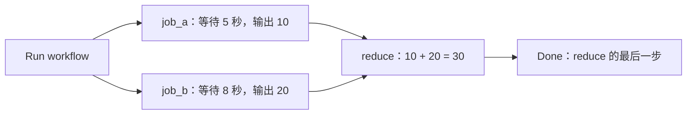

# GitHub Actions 练习仓库

GitHub Actions 让你把自动化流程写进仓库：发生某个事件后，系统安排执行机器，按配置下载代码、运行测试或编译，并展示日志和结果。本指南从基础概念、发布到 GitHub，再到可复制的工作流示例逐步介绍。

- [1. 基础](#1-基础)：术语、费用，以及谁提供和运行虚拟机。
- [2. 发布到 GitHub](#2-发布到-github)：提交代码、推送仓库和首次运行。
- [3. 工作流示例](#3-工作流示例)：Hello、Wait、Two Jobs、Bazel C++ 编译、自定义镜像和动手实验。

## 1. 基础

### 1.1 术语

| 名称 | 中文理解 | 本仓库中的例子 |
|---|---|---|
| Workflow | 一整套自动化流程，由 YAML 文件定义 | `.github/workflows/workflow-playground-hello.yaml` |
| Event | 触发流程的事件 | `workflow_dispatch`：手动触发；`push`：推送代码 |
| Job | 流程中的一个任务 | `hello` |
| Step | 任务内的一步操作 | 下载代码、查看环境、检查文档 |
| Runner | 实际执行任务的机器或运行环境 | 本例使用 GitHub 提供的 Ubuntu 虚拟机 |
| Action | 可重复使用的操作组件 | `actions/checkout@v6` 下载仓库代码 |

`uses:` 调用现成的 Action；`run:` 执行你写的命令。工作流可以有多个 Job；没有依赖关系的 Job 可并行运行，同一 Job 内本例的 Steps 按顺序执行。参见 [GitHub Actions 核心概念](https://docs.github.com/en/actions/get-started/understand-github-actions)。

### 1.2 免费吗？

**将本项目的练习放在公开仓库，使用标准 `ubuntu-latest` Runner，执行本身免费。**

| 场景 | 费用规则 |
|---|---|
| 公开仓库 + 标准 GitHub 托管 Runner | 执行免费 |
| 私有仓库 + GitHub Free | 每月含 2,000 分钟，仓库所有者账户下的私有仓库共享额度 |
| 私有仓库 + GitHub Pro | 每月含 3,000 分钟 |
| Larger runners（更大规格的执行机器） | 收费，公开仓库也一样 |
| 自托管 Runner | GitHub Actions 使用免费，机器和维护成本由你或公司承担 |

以标准 Linux Runner 为例，一个 Job 运行 5 分钟会消耗 5 分钟额度；多个 Job 的执行用量要累计，失败和重新运行也会计入。超额使用可能收费；未绑定有效支付方式时，额度耗尽会停止运行。

运行分钟数与存储额度分别计算：GitHub Free 包含 500 MB 的制品存储额度，与 GitHub Packages 共享；不能把“公开仓库运行免费”理解成所有存储无限免费。本仓库的练习包含日志、文件检查和 C++ 编译，没有上传构建制品。

参见 [GitHub Actions 官方计费说明](https://docs.github.com/en/billing/concepts/product-billing/github-actions)。

### 1.3 虚拟机由谁提供和运行？

**本例由 GitHub 提供和维护执行机器。** 这一行决定使用标准的 GitHub 托管 Ubuntu Runner：

```yaml
runs-on: ubuntu-latest
```

运行过程是：

```text
你点击 Run workflow
        ↓
GitHub Actions 接收触发并安排任务
        ↓
GitHub 提供临时 Ubuntu 虚拟机
        ↓
Runner 按工作流配置下载代码、执行命令 → 返回日志和结果
        ↓
任务结束，临时执行环境被回收
```

流程启动后，你的电脑关机也不影响这个 GitHub 托管任务。`actions/checkout` 下载的是 GitHub 上对应版本的仓库内容，本机尚未推送的修改不会出现在 Runner 上。临时机器里的普通文件也不会自动保存回仓库。

| 方式 | 谁提供、维护机器？ | 适合什么情况？ |
|---|---|---|
| GitHub-hosted runner | GitHub | 入门、常规编译和测试 |
| Self-hosted runner | 你或公司 | 需要公司内网、特定硬件或自定义环境 |

自托管 Runner 必须先安装、注册并保持在线，单纯把配置改成 `runs-on: self-hosted` 不会自动创建机器。参见 [GitHub 托管 Runner](https://docs.github.com/en/actions/concepts/runners/github-hosted-runners) 与 [自托管 Runner](https://docs.github.com/en/actions/concepts/runners/self-hosted-runners)。

## 2. 发布到 GitHub

本地保存 YAML 后，需要将文件提交并推送到 GitHub，才能在那里触发工作流。以下命令在本项目目录执行，使用 `main` 分支。

### 2.1 准备本地提交

本地仓库初始化不需要提交署名，但创建 Commit 需要。若 Git 尚未配置 `user.name` 和 `user.email`，先将下面两个占位值替换为你的提交署名及 GitHub 已验证邮箱（或账户提供的 noreply 邮箱）。这些命令只设置当前仓库：

```bash
cd /Users/xixu/Dropbox/nv-work/nv-projects/topic-github-actions

git config user.name "YOUR_NAME"
git config user.email "YOUR_GITHUB_EMAIL"

git add -A
git commit -m "Add GitHub Actions playground and Chinese guide"
```

这里的 Git 署名配置不等于登录 GitHub；推送时还需要可用的 GitHub 身份认证。

### 2.2 创建远程仓库并推送

首次发布时，在 [GitHub 创建仓库页面](https://github.com/new) 新建名为 `topic-github-actions` 的空仓库，按需要选择公开或私有。因为本地已有文件，远程创建时不要额外勾选 README、`.gitignore` 或 License。若已有远程仓库，直接使用现有仓库。

下面使用账号 `iamxuxiao-nvidia`，通过 HTTPS + Personal Access Token（PAT）推送。准备一个有该仓库写权限的 Token；运行 `git push` 后，在 `Password` 提示处粘贴 Token 并按回车，输入时不会显示字符。

```bash
cd /Users/xixu/Dropbox/nv-work/nv-projects/topic-github-actions

git remote set-url origin https://github.com/iamxuxiao-nvidia/topic-github-actions.git

# 出现 Password 提示时粘贴 PAT
git -c credential.helper= -c credential.username=iamxuxiao-nvidia push -u origin main
```

本地已配置 `origin`，因此使用 `git remote set-url` 更新地址；若首次配置且尚无 `origin`，将该行改为 `git remote add origin https://github.com/iamxuxiao-nvidia/topic-github-actions.git`。这些命令只关联已经创建的远程仓库，本身不会在 GitHub 创建仓库。参见 [将本地代码添加到 GitHub](https://docs.github.com/en/migrations/importing-source-code/using-the-command-line-to-import-source-code/adding-locally-hosted-code-to-github)。

`-c credential.helper=` 仅对本次命令禁用凭据助手，`-c credential.username=iamxuxiao-nvidia` 提供登录用户名；Token 在密码提示处输入，不写入命令、远程 URL 或 Git 配置，也不会交给凭据助手保存。后续推送使用相同命令并再次输入 Token。参见 [GitHub Token 命令行用法](https://docs.github.com/en/authentication/keeping-your-account-and-data-secure/managing-your-personal-access-tokens#using-a-personal-access-token-on-the-command-line) 和 [Git 凭据配置](https://git-scm.com/docs/gitcredentials)。

### 2.3 运行工作流并查看日志

1. 打开 GitHub 仓库，确认默认分支为 `main`，且能看到 `.github/workflows/workflow-playground-hello.yaml`。
2. 点击 **Actions → GitHub Actions Playground - Hello → Run workflow**。
3. 选择 `main`，再次点击 **Run workflow**。
4. 打开新出现的运行记录，再点击任务 `hello`。
5. 展开各步骤，查看输出；正常情况下最终状态为绿色成功。

要运行等待示例，在 **Actions** 中选择 **GitHub Actions Playground - Wait → Run workflow**，打开任务 `wait`，观察“等待 5 秒”和“等待完成后继续执行”两个步骤的日志。

要运行并行汇总示例，在 **Actions** 中选择 **GitHub Actions Playground - Two Jobs → Run workflow**。运行页的任务图中可看到 `job_a`、`job_b` 两个分支汇合到 `reduce`；等待全部完成后，查看 Summary 中的 `Reduce: 10 + 20 = 30` 和 `Done` 步骤日志。

要运行 C++ 编译示例，在 **Actions** 中选择 **GitHub Actions Playground - Hello World Bazel → Run workflow**，打开任务 `hello-world-bazel`，查看编译日志和程序输出。它也会在推送到 `main` 或向 `main` 提交 PR 时自动运行。

手动触发要求工作流使用 `workflow_dispatch`，该工作流文件已存在于默认分支，并且操作人有仓库写权限。Hello、Wait、Two Jobs 只有手动触发；Bazel 工作流同时支持自动与手动触发，首次推送到 `main` 后即可看到构建。参见 [手动运行工作流](https://docs.github.com/en/actions/how-tos/manage-workflow-runs/manually-run-a-workflow)。

也可以完全使用网页：在你拥有写权限的 GitHub 仓库里上传 `README.md`，再通过 **Add file → Create new file** 创建 `.github/workflows/workflow-playground-hello.yaml`，复制第 3 节中 Hello 的 YAML 并提交到默认分支。随后按同样的 Actions 页面操作运行。

## 3. 工作流示例

本项目的 `.github/workflows/` 目录已包含以下四个工作流，均支持 `workflow_dispatch` 手动触发，使用 `ubuntu-latest` Runner。Bazel 工作流还会在推送到 `main` 或向 `main` 提交 PR 时自动运行。

| 工作流（点击查看 YAML） | 触发方式 | Job | 执行内容与预期结果 |
|---|---|---|---|
| [GitHub Actions Playground - Hello](.github/workflows/workflow-playground-hello.yaml) | 手动 | `hello` | 下载仓库代码，打印仓库名称和执行环境，检查 `README.md` 存在且非空。 |
| [GitHub Actions Playground - Wait](.github/workflows/workflow-playground-wait.yaml) | 手动 | `wait` | 打印开始消息，等待 5 秒，再执行下一步并打印完成消息。 |
| [GitHub Actions Playground - Two Jobs](.github/workflows/workflow-two-jobs.yaml) | 手动 | `job_a`、`job_b` → `reduce` | 两个任务并行等待 5 秒和 8 秒，分别输出 10 和 20；两者成功后汇总为 30，写入日志和运行页 Summary，最后执行 `Done` 步骤。 |
| [GitHub Actions Playground - Hello World Bazel](.github/workflows/workflow-hello-world-bazel.yaml) | 推送到 `main`、向 `main` 提交 PR、手动 | `hello-world-bazel` | 用 Bazel 编译并运行 C++ 程序，检查输出为 `Hello, world!`，并写入运行页 Summary。 |

第 3.4 节介绍 Bazel 项目的本地构建和完整工作流；第 3.5 节另提供自定义容器镜像示例，可按说明新增；第 3.6 节提供基于 Hello 的动手实验。

### 3.1 Hello：打印环境并检查文档

保存为 `.github/workflows/workflow-playground-hello.yaml`。以下内容与本仓库提供的文件一致：

```yaml
name: GitHub Actions Playground - Hello

# 在 GitHub 网页上点击 Run workflow 手动触发
on:
  workflow_dispatch:

permissions:
  contents: read

jobs:
  hello:
    runs-on: ubuntu-latest
    timeout-minutes: 5

    steps:
      - name: 下载仓库代码
        uses: actions/checkout@v6

      - name: 查看执行环境
        run: |
          echo "Hello GitHub Actions!"
          echo "当前仓库：$GITHUB_REPOSITORY"
          uname -a
          ls -la

      - name: 检查入门文档
        run: |
          test -s README.md
          echo "检查通过：入门文档存在且非空。"
```

`contents: read` 给工作流读取仓库内容的权限；`timeout-minutes: 5` 给这个练习设置 5 分钟的执行上限。`test -s` 检查指定文件存在且非空。`run: |` 表示下面是多行命令，缩进需要保持一致。

工作流文件必须放在 `.github/workflows/` 中，并使用 `.yml` 或 `.yaml` 扩展名。本例使用 `actions/checkout@v6` 下载仓库代码。参见 [官方快速入门](https://docs.github.com/en/actions/get-started/quickstart) 和 [工作流语法](https://docs.github.com/en/actions/reference/workflows-and-actions/workflow-syntax)。

### 3.2 Wait：等待后继续执行

保存为 `.github/workflows/workflow-playground-wait.yaml`：

```yaml
name: GitHub Actions Playground - Wait

# 在 GitHub 网页上点击 Run workflow 手动触发
on:
  workflow_dispatch:

permissions: {}

jobs:
  wait:
    runs-on: ubuntu-latest
    timeout-minutes: 5

    steps:
      - name: 开始等待示例
        run: echo "准备等待 5 秒。"

      - name: 等待 5 秒
        run: sleep 5

      - name: 等待完成后继续执行
        run: echo "已等待 5 秒，继续执行后续步骤。"
```

`sleep 5` 会暂停当前步骤 5 秒；步骤结束后，Runner 才执行下一步并打印完成消息。这个例子无需读取仓库文件，因此没有下载代码步骤，并使用 `permissions: {}` 关闭仓库 Token 权限。

### 3.3 Two Jobs：并行执行并汇总

保存为 `.github/workflows/workflow-two-jobs.yaml`：

两个并行分支分别等待 5 秒、8 秒，并输出 10、20；`reduce` 等待两个任务都成功完成后，将结果相加得到 30，最后执行 `Done` 步骤。这里共有三个 Job：两个并行任务和一个汇总任务。



```yaml
name: GitHub Actions Playground - Two Jobs

# 在 GitHub 网页上点击 Run workflow 手动触发
on:
  workflow_dispatch:

permissions: {}

jobs:
  # 两个没有依赖关系的任务可以并行运行。
  job_a:
    name: Job A - 等待 5 秒
    runs-on: ubuntu-latest
    timeout-minutes: 5
    outputs:
      value: ${{ steps.compute.outputs.value }}

    steps:
      - name: 等待并生成第一个结果
        id: compute
        run: |
          echo "Job A 开始。"
          sleep 5
          echo "value=10" >> "$GITHUB_OUTPUT"
          echo "Job A 完成，结果为 10。"

  job_b:
    name: Job B - 等待 8 秒
    runs-on: ubuntu-latest
    timeout-minutes: 5
    outputs:
      value: ${{ steps.compute.outputs.value }}

    steps:
      - name: 等待并生成第二个结果
        id: compute
        run: |
          echo "Job B 开始。"
          sleep 8
          echo "value=20" >> "$GITHUB_OUTPUT"
          echo "Job B 完成，结果为 20。"

  reduce:
    name: Reduce - 等待两个任务后汇总
    # 只有两个任务都成功完成，才会执行 reduce。
    needs: [job_a, job_b]
    runs-on: ubuntu-latest
    timeout-minutes: 5

    steps:
      - name: 汇总两个任务的结果
        env:
          VALUE_A: ${{ needs.job_a.outputs.value }}
          VALUE_B: ${{ needs.job_b.outputs.value }}
        run: |
          total=$((VALUE_A + VALUE_B))
          echo "Reduce: $VALUE_A + $VALUE_B = $total"
          echo "Reduce: $VALUE_A + $VALUE_B = $total" >> "$GITHUB_STEP_SUMMARY"

      - name: Done
        run: echo "Done：两个并行任务和汇总步骤都已完成。"
```

`job_a` 和 `job_b` 没有 `needs`，因此可同时等待 Runner 调度；实际开始时间取决于 Runner 和并发额度。`needs: [job_a, job_b]` 是汇合点，保证 `reduce` 等待两者都成功完成。任一任务失败、取消或被跳过时，本例的 `reduce` 和其中的 `Done` 步骤不会执行。

每个分支通过 `$GITHUB_OUTPUT` 写出步骤结果，再用 Job 的 `outputs` 暴露给下游。`reduce` 通过 `needs.job_a.outputs.value` 和 `needs.job_b.outputs.value` 接收结果；相加后打印日志，并写入工作流运行页的 Summary。参见 [Job 依赖](https://docs.github.com/en/actions/how-tos/write-workflows/choose-what-workflows-do/use-jobs) 和 [跨 Job 传递输出](https://docs.github.com/en/actions/how-tos/write-workflows/choose-what-workflows-do/pass-job-outputs)。

### 3.4 Bazel：编译并运行 C++ Hello World

第四个工作流是 [.github/workflows/workflow-hello-world-bazel.yaml](.github/workflows/workflow-hello-world-bazel.yaml)。它在 Ubuntu Runner 上下载代码、安装 Bazelisk、调用 Bazel 编译，再运行程序并检查输出。

项目文件说明：

- [hello-world/main.cc](hello-world/main.cc)：程序入口，打印 `Hello, world!`。
- [hello-world/BUILD.bazel](hello-world/BUILD.bazel)：使用 `rules_cc` 的 `cc_binary` 规则，把 `main.cc` 编译成 `hello-world` 可执行文件。
- [MODULE.bazel](MODULE.bazel)：定义仓库根目录为 Bazel 模块，并声明 `rules_cc` 依赖；[.bazelversion](.bazelversion) 固定 Bazel 为 `8.4.2`，本地和 CI 都通过 Bazelisk 读取这个版本。

在本地先安装 [Bazelisk](https://github.com/bazelbuild/bazelisk#installation) 和 C++ 编译器。macOS 可以使用 `brew install bazelisk`，并通过 `xcode-select --install` 安装命令行开发工具；Ubuntu 可以安装 `build-essential`，再按 Bazelisk 官方说明安装启动器。首次构建需要联网下载 Bazel 和构建规则。

在仓库根目录运行：

```bash
bazel build //hello-world:hello-world
bazel run //hello-world:hello-world
```

程序输出为：

```text
Hello, world!
```

`//hello-world:hello-world` 中，`//hello-world` 指仓库根目录下的包，冒号后的 `hello-world` 是 `BUILD.bazel` 中的目标名称。`bazel build` 只编译，`bazel run` 会先确保目标已构建，再执行程序。也可直接运行 `./bazel-bin/hello-world/hello-world`；根目录下的 `bazel-*` 构建输出链接已加入 `.gitignore`。Bazel 可能生成 `MODULE.bazel.lock` 来记录依赖解析信息，它不是可执行文件。

完整工作流如下：

```yaml
name: GitHub Actions Playground - Hello World Bazel

# 推送到 main、向 main 提交 PR，或在网页上手动触发
on:
  push:
    branches: [main]
  pull_request:
    branches: [main]
  workflow_dispatch:

permissions:
  contents: read

jobs:
  hello-world-bazel:
    runs-on: ubuntu-latest
    timeout-minutes: 15

    steps:
      - name: 下载仓库代码
        uses: actions/checkout@v6

      - name: 安装 Bazelisk（读取 .bazelversion）
        uses: bazel-contrib/setup-bazel@0.19.0

      - name: 使用 Bazel 编译 C++ Hello World
        run: bazel build //hello-world:hello-world

      - name: 运行程序并检查输出
        run: |
          output=$(bazel run //hello-world:hello-world)
          printf '%s\n' "$output"
          test "$output" = "Hello, world!"
          echo "Bazel 编译成功，程序输出：$output" >> "$GITHUB_STEP_SUMMARY"
```

`setup-bazel` 安装 Bazelisk；Bazelisk 根据 `.bazelversion` 下载并启动指定版本的 Bazel。编译失败时工作流会失败；程序运行失败或输出不匹配时，最后一步也会失败。成功时日志和运行页 Summary 都能看到 `Hello, world!`。参见 [setup-bazel 使用说明](https://github.com/bazel-contrib/setup-bazel) 和 [Bazel C++ 入门](https://bazel.build/start/cpp)。

### 3.5 使用自定义容器镜像

通过 `jobs.<job_id>.container.image` 可以指定 Job 的执行环境，把所需的语言、工具和依赖放进镜像。`runs-on` 选择承载任务的 Runner，`container.image` 选择在该 Runner 上启动的容器；这个 Job 的普通 `run` 步骤会在容器内执行。参见 [GitHub：在容器中运行 Job](https://docs.github.com/en/actions/how-tos/write-workflows/choose-where-workflows-run/run-jobs-in-a-container)。

#### 3.5.1 先使用公开镜像

下面是一个可选的新增工作流示例，保存为 `.github/workflows/workflow-custom-image.yaml`，提交并推送到默认分支后，在 Actions 中选择 **GitHub Actions Playground - Custom Image → Run workflow**：

```yaml
name: GitHub Actions Playground - Custom Image

on:
  workflow_dispatch:

permissions:
  contents: read

jobs:
  custom_image:
    runs-on: ubuntu-latest
    timeout-minutes: 5
    container:
      image: python:3.12-slim-bookworm

    steps:
      - name: 下载仓库代码
        uses: actions/checkout@v6

      - name: 查看容器环境并检查文档
        run: |
          cat /etc/os-release
          python --version
          test -s README.md
          echo "检查通过：已在容器中运行并读取仓库文档。"
```

这个示例使用 [Python 官方镜像](https://github.com/docker-library/python/blob/master/3.12/slim-bookworm/Dockerfile)，日志会显示容器的系统信息和 Python 版本。要使用已有的自定义镜像，将 `image` 改为实际地址，例如 `ghcr.io/your-owner/actions-playground:1.0`；私有镜像还需按第 3.5.3 节配置认证。

#### 3.5.2 构建并发布自己的镜像

例如，在仓库根目录创建 `Dockerfile`，在 Python 镜像中预装 Git 和编译工具：

```dockerfile
FROM python:3.12-slim-bookworm

RUN apt-get update \
    && apt-get install -y --no-install-recommends bash ca-certificates git build-essential \
    && rm -rf /var/lib/apt/lists/*
```

在已安装并启动 Docker、且可使用 Buildx 的本机执行以下命令。将 `YOUR_GITHUB_USERNAME` 替换为登录账号，`your-owner` 替换为有发布权限的个人或组织名称（镜像路径使用小写）。登录时在密码提示处输入具有 `write:packages` 权限的 PAT（classic）；组织启用 SSO 时还需为 Token 授权。参见 [GHCR 认证与发布说明](https://docs.github.com/en/packages/working-with-a-github-packages-registry/working-with-the-container-registry)。

```bash
docker login ghcr.io --username YOUR_GITHUB_USERNAME
docker buildx build --platform linux/amd64 \
  --tag ghcr.io/your-owner/actions-playground:1.0 \
  --push .
```

在包含 `Dockerfile` 的目录运行构建命令。这里为示例中的标准 `ubuntu-latest` Runner 构建 `linux/amd64` 镜像，在 Apple Silicon 等 ARM 电脑上也显式指定该目标；`--push` 将构建结果发布到 GHCR。参见 [Docker Buildx 参数说明](https://docs.docker.com/reference/cli/docker/buildx/build/)。

发布成功后，将第 3.5.1 节的 `image` 改为 `ghcr.io/your-owner/actions-playground:1.0`。GHCR 首次发布的包默认是私有的，可按下一步配置读取权限，或在包设置中将其公开；公开镜像可匿名拉取。需要固定镜像内容时，可使用 `ghcr.io/your-owner/actions-playground@sha256:实际摘要`，摘要可从构建输出中取得。参见 [GHCR 镜像可见性与摘要拉取](https://docs.github.com/en/packages/working-with-a-github-packages-registry/working-with-the-container-registry)。

#### 3.5.3 使用私有镜像

对于 GHCR 私有镜像，先在该包的 **Package settings → Manage Actions access** 中给当前工作流仓库授予读取权限，再将第 3.5.1 节工作流顶部的 `permissions` 改为：

```yaml
permissions:
  contents: read
  packages: read
```

将同一工作流中 `jobs.custom_image.container` 的配置替换为以下内容，保留其余 Job 配置和步骤：

```yaml
container:
  image: ghcr.io/your-owner/actions-playground:1.0
  credentials:
    username: ${{ github.actor }}
    password: ${{ secrets.GITHUB_TOKEN }}
```

`GITHUB_TOKEN` 由 GitHub 自动提供，无需手动创建同名 Secret；`packages: read` 还需要配合包对该仓库的访问授权。参见 [配置包的 Actions 访问权限](https://docs.github.com/en/packages/learn-github-packages/configuring-a-packages-access-control-and-visibility#ensuring-workflow-access-to-your-package)。其他私有 Registry 可将 `credentials.username` 和 `credentials.password` 分别改为 `${{ secrets.REGISTRY_USERNAME }}` 和 `${{ secrets.REGISTRY_TOKEN }}`，并在仓库 **Settings → Secrets and variables → Actions** 中创建对应 Secret。参见 [容器镜像认证配置](https://docs.github.com/en/actions/how-tos/write-workflows/choose-where-workflows-run/run-jobs-in-a-container#defining-credentials-for-a-container-registry)。

使用时注意以下执行条件：

- 容器 Job 要求 Linux Runner；GitHub 托管 Runner 使用 Ubuntu，自托管 Runner 需要 Linux 和已安装的 Docker。参见 [容器 Job 运行要求](https://docs.github.com/en/actions/reference/workflows-and-actions/workflow-syntax#jobsjob_idcontainer)。
- Job 容器在执行步骤前就会拉取并启动，因此镜像必须提前发布且能被 Runner 访问。镜像应在本机或前置 Job 中构建并发布；当前 Job 拉取私有镜像时使用上面的 `container.credentials`。
- 容器中 `run` 默认使用 `sh`。需要 Bash 语法时，确保镜像已安装 Bash，并给相应步骤设置 `shell: bash`。参见 [容器内的默认 Shell](https://docs.github.com/en/actions/how-tos/write-workflows/choose-where-workflows-run/run-jobs-in-a-container)。
- `container` 配置仅对所属 Job 生效。例如，若要让本项目的 `job_a`、`job_b` 和 `reduce` 都使用自定义镜像，需要在三个 Job 下分别配置。

### 3.6 动手实验

#### 实验 A：故意失败，再修复

在 Hello 工作流最后一步，把原来的检查命令改成检查一个不存在的文件：

```bash
test -f missing.txt
echo "这句话在前一条命令失败后不会执行。"
```

提交并推送修改，然后再次手动运行。你会看到检查步骤失败，日志中显示非零退出码。将命令恢复为 `test -s README.md`，再次提交、推送和运行，就能观察从失败到成功的变化。

默认情况下，普通后续步骤会在前面步骤失败后跳过；本例没有设置 `continue-on-error` 或其他异常处理规则。参见 [工作流语法](https://docs.github.com/en/actions/reference/workflows-and-actions/workflow-syntax)。

#### 实验 B：每次推送到 main 都自动运行

将 Hello 工作流原来的整个 `on:` 区块替换为：

```yaml
on:
  push:
    branches: [main]
  workflow_dispatch:
```

这样既保留手动按钮，也会在推送到 `main` 时自动运行。修改本地文件后执行：

```bash
git add .github/workflows/workflow-playground-hello.yaml
git commit -m "Run playground on pushes to main"
# 出现 Password 提示时粘贴 PAT
git -c credential.helper= -c credential.username=iamxuxiao-nvidia push
```

上述命令在本地仓库目录执行，且已按第 2 节配置远程仓库及首次推送。之后刷新 GitHub 的 Actions 页面观察自动出现的运行记录。触发规则见 [工作流事件](https://docs.github.com/en/actions/reference/workflows-and-actions/events-that-trigger-workflows)。
