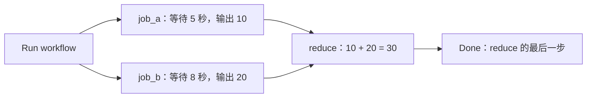

# GitHub Actions 练习仓库

中文入门、运行机制、费用和可复制示例见 [readme-github-actions.md](readme-github-actions.md)。

工作流文件：

- [Hello](.github/workflows/workflow-playground-hello.yaml)：打印执行环境并检查入门文档。
- [Wait](.github/workflows/workflow-playground-wait.yaml)：等待 5 秒后继续执行下一步。
- [Two Jobs](.github/workflows/workflow-two-jobs.yaml)：两个任务并行执行，完成后汇总结果并结束。

将仓库发布到 GitHub 后，打开 **Actions**，选择 **GitHub Actions Playground - Hello**、**GitHub Actions Playground - Wait** 或 **GitHub Actions Playground - Two Jobs**，再点击 **Run workflow**，即可运行示例。工作流需先出现在默认分支，且仓库已启用 Actions。

完整 YAML 如下，保存为 `.github/workflows/workflow-playground-hello.yaml`：

```yaml
name: GitHub Actions Playground - Hello

# 在 GitHub 网页上点击 Run workflow 手动触发
on:
  workflow_dispatch:

permissions:
  contents: read

jobs:
  hello:
    runs-on: ubuntu-latest
    timeout-minutes: 5

    steps:
      - name: 下载仓库代码
        uses: actions/checkout@v6

      - name: 查看执行环境
        run: |
          echo "Hello GitHub Actions!"
          echo "当前仓库：$GITHUB_REPOSITORY"
          uname -a
          ls -la

      - name: 检查入门文档
        run: |
          test -s readme-github-actions.md
          echo "检查通过：入门文档存在且非空。"
```

等待示例保存为 `.github/workflows/workflow-playground-wait.yaml`：

```yaml
name: GitHub Actions Playground - Wait

# 在 GitHub 网页上点击 Run workflow 手动触发
on:
  workflow_dispatch:

permissions: {}

jobs:
  wait:
    runs-on: ubuntu-latest
    timeout-minutes: 5

    steps:
      - name: 开始等待示例
        run: echo "准备等待 5 秒。"

      - name: 等待 5 秒
        run: sleep 5

      - name: 等待完成后继续执行
        run: echo "已等待 5 秒，继续执行后续步骤。"
```

并行与汇总示例保存为 `.github/workflows/workflow-two-jobs.yaml`：

两个并行分支分别等待 5 秒、8 秒，并输出 10、20；`reduce` 等待两个任务都成功完成后，将结果相加得到 30，最后执行 `Done` 步骤。这里共有三个 Job：两个并行任务和一个汇总任务。



```yaml
name: GitHub Actions Playground - Two Jobs

# 在 GitHub 网页上点击 Run workflow 手动触发
on:
  workflow_dispatch:

permissions: {}

jobs:
  # 两个没有依赖关系的任务可以并行运行。
  job_a:
    name: Job A - 等待 5 秒
    runs-on: ubuntu-latest
    timeout-minutes: 5
    outputs:
      value: ${{ steps.compute.outputs.value }}

    steps:
      - name: 等待并生成第一个结果
        id: compute
        run: |
          echo "Job A 开始。"
          sleep 5
          echo "value=10" >> "$GITHUB_OUTPUT"
          echo "Job A 完成，结果为 10。"

  job_b:
    name: Job B - 等待 8 秒
    runs-on: ubuntu-latest
    timeout-minutes: 5
    outputs:
      value: ${{ steps.compute.outputs.value }}

    steps:
      - name: 等待并生成第二个结果
        id: compute
        run: |
          echo "Job B 开始。"
          sleep 8
          echo "value=20" >> "$GITHUB_OUTPUT"
          echo "Job B 完成，结果为 20。"

  reduce:
    name: Reduce - 等待两个任务后汇总
    # 只有两个任务都成功完成，才会执行 reduce。
    needs: [job_a, job_b]
    runs-on: ubuntu-latest
    timeout-minutes: 5

    steps:
      - name: 汇总两个任务的结果
        env:
          VALUE_A: ${{ needs.job_a.outputs.value }}
          VALUE_B: ${{ needs.job_b.outputs.value }}
        run: |
          total=$((VALUE_A + VALUE_B))
          echo "Reduce: $VALUE_A + $VALUE_B = $total"
          echo "Reduce: $VALUE_A + $VALUE_B = $total" >> "$GITHUB_STEP_SUMMARY"

      - name: Done
        run: echo "Done：两个并行任务和汇总步骤都已完成。"
```
